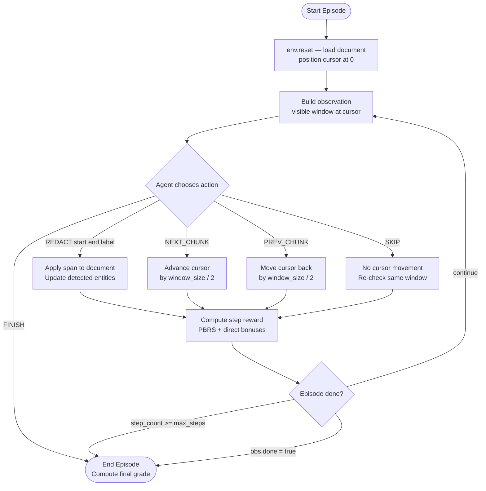
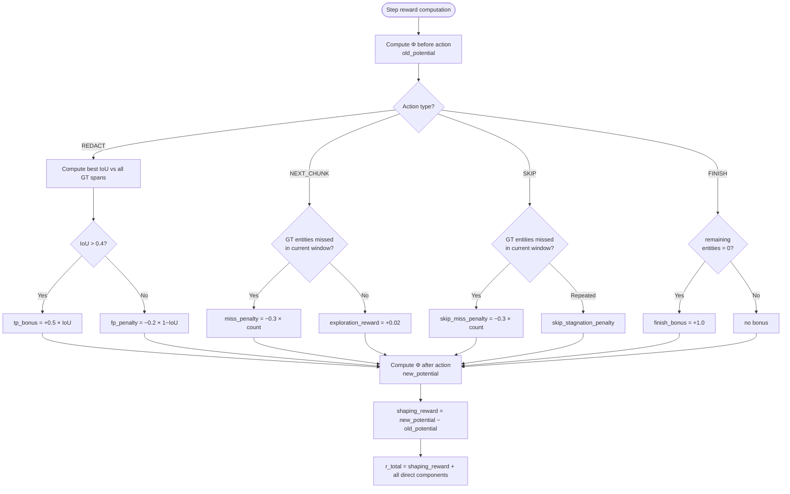
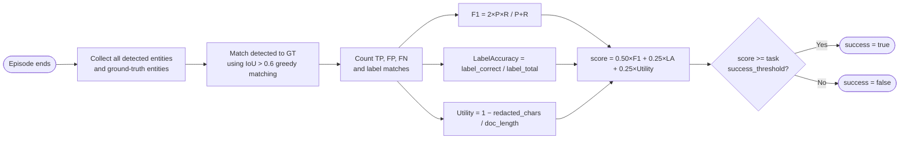
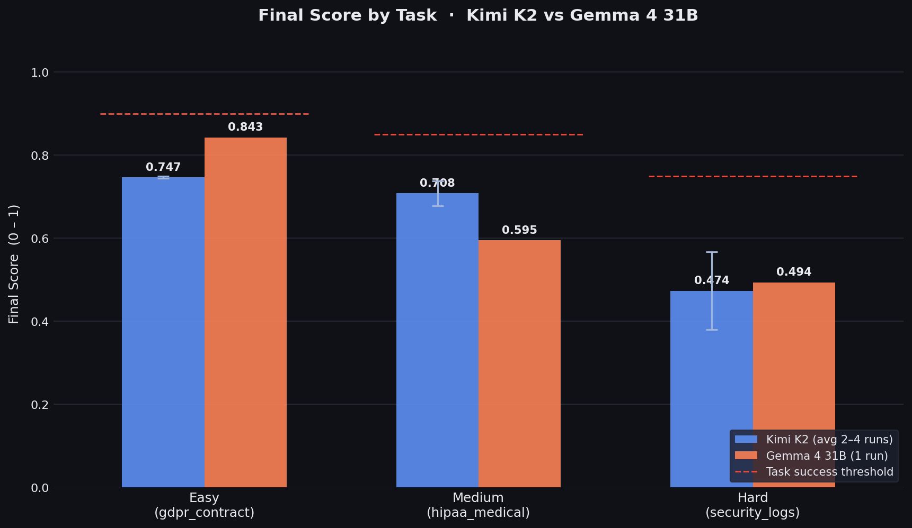
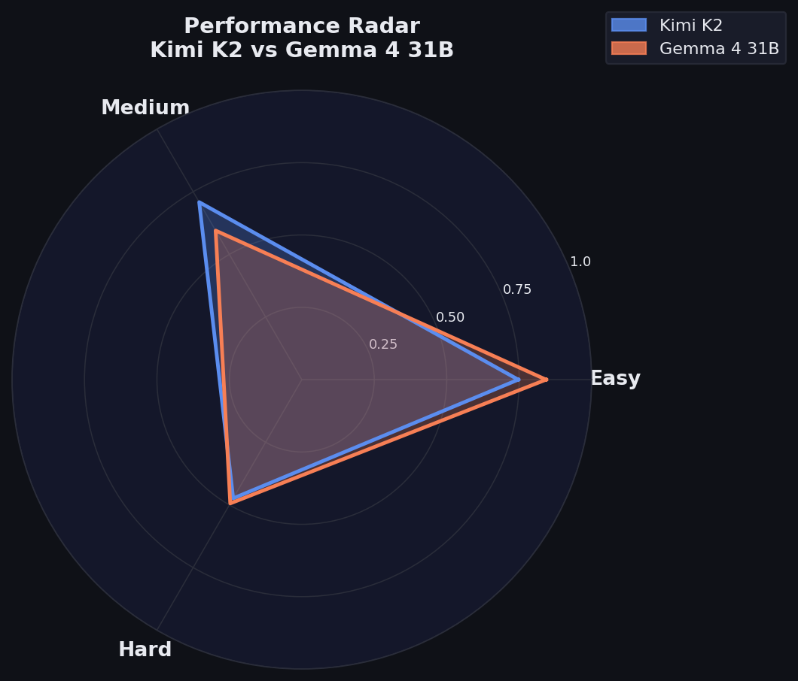
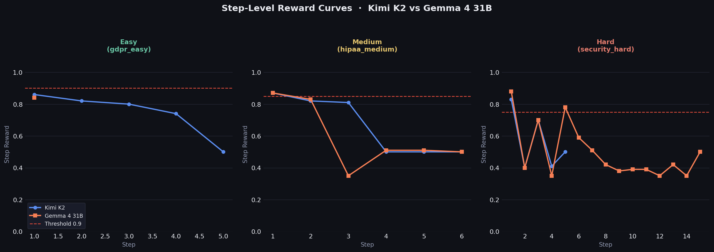
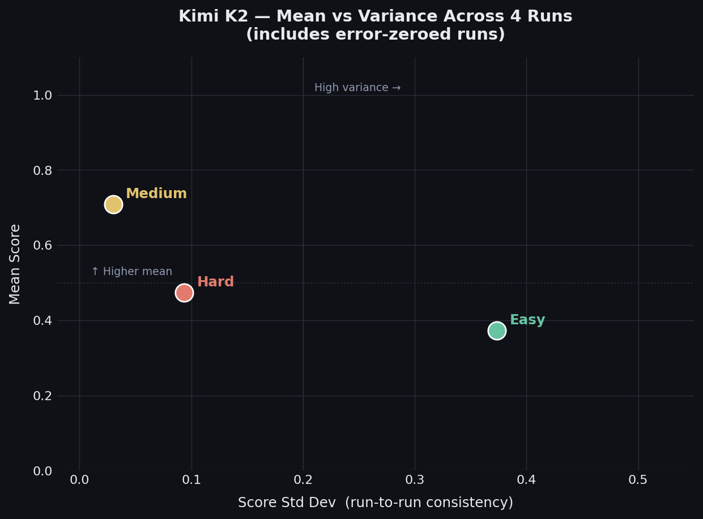

# PII Redaction Env


---

## Table of Contents

- [Why This Environment Exists](#why-this-environment-exists)
- [Tasks and Difficulty](#tasks-and-difficulty)
- [Environment Overview](#environment-overview)
- [State Space - What the Agent Sees](#state-space--what-the-agent-sees)
- [Action Space - What the Agent Can Do](#action-space--what-the-agent-can-do)
- [Reward Model](#reward-model)
- [Final Grading](#final-grading)
- [OpenEnv Integration](#openenv-integration)
- [Setup and Run](#setup-and-run)
- [Docker](#docker)
- [Benchmark Results](#benchmark-results)
- [Example Inference Output](#example-inference-output)
- [Project Layout](#project-layout)
- [Hugging Face Spaces](#hugging-face-spaces)

---

## Why This Environment Exists

Large language models are increasingly deployed in workflows that touch sensitive data — medical records, HR documents, legal contracts, support transcripts. The assumption is often that an LLM can reliably identify and redact personally identifiable information (PII) before that data is stored, shared, or processed further.

In practice, this assumption breaks down in several well-documented ways:

**Span imprecision.** LLMs frequently identify the right entity but return incorrect character offsets — cutting off the first letter of a name, including trailing punctuation in a phone number, or capturing only the numeric tail of a written-out value like `"area code four-one-five, then 555-0187"`. In downstream redaction pipelines, even a one-character offset can leave PII partially exposed.

**Obfuscation blindness.** Users and adversarial actors routinely encode PII to evade automated detection: `"john dot smith at gmail dot com"`, `"three four five dash six seven dash eight nine zero one"`, `"oh-three slash fifteen slash seventy-eight"`. Models trained on clean structured text often miss these patterns entirely.

**Over-redaction.** Aggressive models redact company names, product codes, and infrastructure terms alongside personal identifiers. This destroys document utility and makes redacted outputs unusable for their intended operational purpose (audit trails, clinical records, compliance reviews).

**Label confusion.** Even when a span is found, the entity type is misclassified — a date of birth labelled as ADDRESS, an SSN labelled as PHONE. For compliance workflows, the label is as important as the span: GDPR Article 9 and HIPAA 45 CFR §164.514 treat different PII categories differently.

**Sparse feedback.** Most existing PII benchmarks evaluate a model's final output against a reference set, providing no signal about the quality of individual decisions within a document. This makes it difficult to identify which failure mode is responsible for a poor result, or to train agents that improve their behaviour mid-episode.

This environment addresses all five problems. It provides a sequential, step-level evaluation framework where an agent must scan a document window-by-window, decide what to redact and how to label it, and be rewarded or penalized at each step in proportion to the quality of that specific decision.

---

## Tasks and Difficulty

| Task | Difficulty | Objective | Success threshold | Max steps |
|---|---|---|---|---|
| `gdpr_contract_easy` | Easy | Obvious PII in business contracts — emails, phones, addresses. Regex-friendly patterns. | 0.90 | 40 |
| `hipaa_medical_medium` | Medium | Contextual medical identifiers — names, DOBs, phones, addresses embedded in clinical notes. Requires sentence-level context. | 0.85 | 60 |
| `security_logs_hard` | Hard | Obfuscated and adversarial PII in support transcripts — written-out values, nested references, deliberate encoding. Over-redaction is penalized. | 0.75 | 80 |

---

## Environment Overview

The environment models PII redaction as a sequential decision problem. A document is too long to process all at once; the agent sees it through a sliding window and must scan, identify, and redact entities over multiple steps. Every step produces a structured reward that reflects the quality of that specific action.



---

## State Space — What the Agent Sees

At every step the agent receives a `RedactionObservation` with the following fields:

| Field | Type | Description |
|---|---|---|
| `visible_text` | `str` | The current document window (`window_size` characters starting at `cursor_position`). Spans already redacted in this episode are masked as `[REDACTED]` or `████`. |
| `cursor_position` | `int` | Absolute character offset of the window's left edge in the full document. All start/end indices in actions are absolute offsets from position 0 of the document. |
| `document_length` | `int` | Total character count of the full document. |
| `redacted_spans` | `list[tuple[int,int]]` | All `(start, end)` spans committed by `REDACT` actions so far this episode. Agents should not re-redact these. |
| `progress_pct` | `float` | `window_end / document_length` — fraction of the document that the window has reached. Reaches `1.0` only when the window end touches the final character. |
| `previous_actions` | `list[str]` | The last 5 action strings taken, in order. Useful for detecting navigation loops. |
| `done` | `bool` | `True` if the episode has terminated (via `FINISH` or max steps exhausted). |

### Navigation hints

The `previous_actions` field is the main signal for detecting loops and recovering from missed entities. Use it to decide when to revisit a window or move forward.

### Absolute indexing

All span coordinates are **absolute**, not relative to the window. To convert a position visible in the window to an absolute document index:

```
absolute_index = cursor_position + relative_offset_in_visible_text
```

Example: if `cursor_position = 50` and `"John"` starts at relative offset 8 in `visible_text`, then `absolute_start = 58` and `absolute_end = 62`.

### Masked text

When the window overlaps a previously redacted span, that region is shown as `[REDACTED]` (for spans up to 10 chars) or filled with `█` characters to preserve the original span length. This means the character counts and absolute offsets of surrounding text are not shifted — the agent can still compute correct absolute indices for unredacted regions within the same window.

---

## Action Space — What the Agent Can Do

| Action | Required fields | Effect |
|---|---|---|
| `REDACT` | `start`, `end`, `label` | Commits a redaction span. Must include an absolute `start`, `end`, and a PII type label. Invalid spans (out of bounds, end ≤ start, duplicate with IoU > 0.8) are rejected and penalized. |
| `NEXT_CHUNK` | — | Slides the window forward by `window_size // 2` characters. This is the default navigation action after a clean window. Moving forward when unredacted entities are still visible in the current window incurs a miss penalty. |
| `PREV_CHUNK` | — | Slides the window backward by `window_size // 2`. Use it when you likely missed PII in the prior window or need to recover a partial span. |
| `SKIP` | — | No cursor movement. It only re-checks the same window. Using SKIP when PII is visible incurs a miss penalty, and repeated SKIP actions trigger a stagnation penalty. |
| `FINISH` | — | Terminates the episode. If all ground-truth entities have been matched (`remaining_entities == 0`), the agent receives a large finish bonus of `+1.0`. If any entities are unmatched, no bonus is awarded and the episode ends at whatever F1 the agent achieved. |

### Valid label values

`EMAIL` · `PHONE` · `SSN` · `NAME` · `ADDRESS` · `DOB`

### Navigation strategy

SKIP does not move the cursor, so repeated SKIP can trap the agent on the same window. Use NEXT_CHUNK as the default move when a window looks clean. Use PREV_CHUNK when the current or previous window likely still contains missed PII, especially after a low-reward step or when `previous_actions` shows repeated NEXT_CHUNK or SKIP.

---

## Reward Model

### Background — Potential-Based Reward Shaping (PBRS)

Training an agent on a single end-of-episode score means every intermediate action receives zero gradient signal until the episode ends. For long documents with many entities, this makes learning extremely slow.

Potential-Based Reward Shaping (Ng, Harada & Russell, 1999) provides a principled solution. A **potential function** Φ(s) assigns a scalar value to each state — intuitively, how good the current state is. The shaped reward at each step is defined as:

> Ng, A. Y., Harada, D., & Russell, S. (1999). **Policy invariance under reward transformations: Theory and application to reward shaping.** In *Proceedings of the 16th International Conference on Machine Learning (ICML)*, pp. 278–287.

The key theorem is that adding shaped rewards of this form to any reward function does **not change the optimal policy** — the agent that was optimal before shaping remains optimal after. This makes PBRS safe to add on top of any existing reward without needing to retune the policy target.

### Potential Function

The potential Φ(s) measures document quality at the current state, defined identically to the final grading metric:

```
Φ(s) = 0.50 × F1  +  0.25 × LabelAccuracy  +  0.25 × Utility
```

Where:

- **F1** is the harmonic mean of span-detection precision and recall, computed against all ground-truth entities using relaxed IoU matching (threshold > 0.4 for rewards, > 0.6 for final grading).
- **LabelAccuracy** is the fraction of matched spans where the agent's label equals the ground-truth label.
- **Utility** is `1 − (total_redacted_chars / document_length)` — penalizes over-redaction linearly. A perfectly precise agent that redacts only what is necessary scores 1.0 on utility.

All three components are in [0, 1], so Φ(s) is also in [0, 1].

### Shaping Reward

At each step, the shaping reward is the change in potential:

```
r_shape = γ × Φ(s') − Φ(s)
```

where γ = 1.0 (appropriate for episodic tasks; preserves policy invariance with the F1 metric).

A good action (new TP, correct label) increases Φ and produces a positive shaping signal. A bad action (FP, wrong label) either decreases Φ or leaves it unchanged, producing zero or negative shaping.

### Direct Reward Components

In addition to shaping, several direct bonuses and penalties are applied per step. These encode constraints that the potential function alone cannot express efficiently (such as punishing specific bad patterns immediately):

| Component | Condition | Value |
|---|---|---|
| `tp_bonus` | REDACT where best IoU with any GT entity > 0.4 | `+0.5 × IoU` |
| `fp_penalty` | REDACT where best IoU with any GT entity ≤ 0.4 | `−0.2 × (1 − IoU)` |
| `duplicate_penalty` | REDACT on a span with IoU > 0.8 vs a recent span | `−0.2 × duplicate_count` |
| `invalid_penalty` | Out-of-bounds span, end ≤ start, or any malformed action | `−1.0` |
| `miss_penalty` | NEXT_CHUNK while unredacted GT entities overlap visible window | `−0.3 × missed_count` |
| `exploration_reward` | NEXT_CHUNK and no GT entities missed in current window | `+0.02` |
| `finish_bonus` | FINISH and all GT entities matched (remaining = 0) | `+1.0` |
| `skip_miss_penalty` | SKIP while unredacted GT entities overlap visible window | `−0.3 × missed_count` |
| `skip_stagnation_penalty` | More than 1 consecutive SKIP action | `−0.05 × min(5, trailing_skips − 1)` |

`previous_actions` is included in observations so the agent can detect repeated SKIP or NEXT_CHUNK loops. A repeated SKIP pattern is a sign to move forward or revisit earlier context instead of staying on the same window.

### Total Step Reward

```
r_total = r_shape + tp_bonus + fp_penalty + duplicate_penalty
        + invalid_penalty + miss_penalty + exploration_reward
        + finish_bonus + skip_miss_penalty + skip_stagnation_penalty
```

The environment computes and returns raw step reward (`raw_total`). In `inference.py`, displayed step rewards are normalized/clamped to [0, 1] using `(raw + 1) / 2` for easier human-readable logs.



---

## Final Grading

At episode end, `grade()` computes a final score independent of the step rewards, using a stricter IoU threshold (> 0.6) for span matching:

```
score = 0.50 × F1  +  0.25 × LabelAccuracy  +  0.25 × Utility
```

The episode is marked `success = True` if `score >= success_threshold` for the task.



---

---

## OpenEnv Integration

This project is built using the **OpenEnv** framework, providing a standardized interface for research-grade environments.

### Core Components
- **`RedactionEnvironment`**: The server-side logic in [server/pii_redaction_env_environment.py](file:///c:/CodingNest/pii_redaction_env/server/pii_redaction_env_environment.py) inherits from `openenv.core.Environment`. This handles the `reset`, `step`, and `grade` API calls.
- **`openenv.yaml`**: The configuration file that defines the environment's metadata, entry point, and Hugging Face Space settings.

### CLI & Library Usage
- **`openenv validate`**: Used to verify that the environment and its associated `Dockerfile` are compliant with the OpenEnv specification. This is run as part of the [pre_val.sh](file:///c:/CodingNest/pii_redaction_env/pre_val.sh) script.
- **`openenv push`**: Packages the current directory and deploys it to Hugging Face as a Docker-based Space.
- **`openenv fork`**: Used to create local copies of existing environments for research and development.
- **`openenv-core`**: The Python library used by both the environment server (for definitions) and [client.py](file:///c:/CodingNest/pii_redaction_env/client.py) (for managing connections and Docker lifecycle).

---

## Setup and Run

Install:

```bash
uv sync
```

Run tests:

```bash
uv run pytest
```

Start server locally:

```bash
uv run uvicorn server.app:app --reload --host 0.0.0.0 --port 7860
```

Run inference:

```bash
uv run python inference.py
```

Each inference run writes artifacts under `outputs/`:

- `inference_YYYYMMDD_HHMMSS.log` — full step-by-step run log
- `summary_YYYYMMDD_HHMMSS.json` — structured per-task summary (score, steps, rewards, timing)

### Environment variables

| Variable | Default | Description |
|---|---|---|
| `HF_TOKEN` | — | Hugging Face / OpenAI-compatible API key (required) |
| `API_BASE_URL` | `https://router.huggingface.co/v1` | LLM API endpoint |
| `MODEL_NAME` | `Qwen/Qwen2.5-72B-Instruct` | Model identifier |
| `CONTAINER_BASE_URL` | `http://localhost:7860` | Existing environment endpoint used by default inference mode |
| `USE_DOCKER_IMAGE` | `0` | If `1/true/yes`, inference launches env via `from_docker_image()` |
| `LOCAL_IMAGE_NAME` | — | Docker image name used when `USE_DOCKER_IMAGE=1` |
| `TEMPERATURE` | `0.0` | LLM sampling temperature |
| `OPENAI_SEED` | `42` | Reproducibility seed |
| `INFERENCE_MAX_STEPS` | `100` | Hard step limit per episode |
| `REQUEST_TIMEOUT_S` | `30` | LLM request timeout in seconds |
| `OPENAI_MAX_RETRIES` | `0` | SDK-level retry count for model calls |
| `RETRY_ON_TRANSIENT_ERRORS` | `0` | If enabled, inference performs one explicit retry on timeout/5xx |
| `PII_WINDOW_SIZE` | `500` | Document window size in characters (server side) |

---

## Docker

Build image:

```bash
docker build -t pii_redaction_env-env:latest -f server/Dockerfile .
```

Run container:

```bash
docker run --rm -p 7860:7860 pii_redaction_env-env:latest
```

---

---

## Benchmark Results

We evaluated two models on all three tasks using `PII_WINDOW_SIZE=200` and `TEMPERATURE=0.0`.
Kimi K2 was run four times (easy scores from two error-free runs only; medium and hard from all four);
Gemma 4 31B was run once. Scores reported are final episode grades in [0, 1].


### Configuration

| Setting | Value |
|---|---|
| `PII_WINDOW_SIZE` | 200 |
| `TEMPERATURE` | 0.0 |
| `OPENAI_SEED` | 42 |
| Kimi K2 runs | 4 (2 easy errors excluded) |
| Gemma 4 31B runs | 1 |

### Score Summary

| Task | Success threshold | Kimi K2 (avg) | Gemma 4 31B | Kimi meets threshold? | Gemma meets threshold? |
|---|---|---|---|---|---|
| Easy — `gdpr_contract_easy` | 0.90 | 0.747 | 0.843 | ✗ | ✗ |
| Medium — `hipaa_medical_medium` | 0.85 | 0.709 | 0.595 | ✗ | ✗ |
| Hard — `security_logs_hard` | 0.75 | 0.474 | 0.494 | ✗ | ✗ |

Neither model consistently reaches the task success thresholds under `PII_WINDOW_SIZE=200`,
which is deliberately narrow to stress-test multi-step navigation and reduce the PII visible per window.

### Key observations

**Easy task.** Gemma scores higher (0.843 vs 0.747 average) but its single run was cut short by a timeout
at step 2, leaving several entities unredacted. Kimi is more stable across runs but consistently misses
one or two entities (typically the NAME span) before calling `FINISH`.

**Medium task.** Kimi outperforms Gemma (0.709 vs 0.595). Gemma navigates past entities without
redacting them and terminates early. The miss-penalty on `NEXT_CHUNK` when GT entities are visible
in the window is the main reward drag for both models.

**Hard task.** Both models struggle with obfuscated PII. The common failure mode is span truncation —
capturing only the numeric tail of a written-out phone number rather than the full phrase. Kimi shows
high variance (std = 0.10) partly due to two runs that were cut short by connection errors.

### Plots

**Figure 1 — Final scores by task with error bars (Kimi) and task success thresholds**



**Figure 2 — Performance radar across all three task dimensions**



**Figure 3 — Step-level reward traces (best clean run per model per task)**



**Figure 4 — Kimi K2 mean score vs run-to-run variance (all 4 runs; error runs = 0)**




## Example Inference Output

The sample below was produced with `PII_WINDOW_SIZE=500` (default).

```text
[START] task=gdpr_contract_easy env=pii_redaction model=google/gemma-4-31b-it
[STEP] step=1 action=REDACT(59,69) reward=0.86 done=false error=null
[STEP] step=2 action=REDACT(85,108) reward=0.85 done=false error=null
[STEP] step=3 action=REDACT(123,131) reward=0.73 done=false error=null
[STEP] step=4 action=FINISH reward=0.50 done=true error=null
[END] success=true steps=4 score=0.736 rewards=0.86,0.85,0.73,0.50

[START] task=hipaa_medical_medium env=pii_redaction model=google/gemma-4-31b-it
[STEP] step=1 action=REDACT(56,73) reward=0.89 done=false error=null
[STEP] step=2 action=REDACT(95,116) reward=0.81 done=false error=null
[STEP] step=3 action=FINISH reward=0.50 done=true error=null
[END] success=true steps=3 score=0.732 rewards=0.89,0.81,0.50

[START] task=security_logs_hard env=pii_redaction model=google/gemma-4-31b-it
[STEP] step=1 action=REDACT(61,70) reward=0.94 done=false error=null
[STEP] step=2 action=REDACT(129,137) reward=0.40 done=false error=null
[STEP] step=3 action=REDACT(178,213) reward=0.81 done=false error=null
[STEP] step=4 action=REDACT(338,368) reward=0.38 done=false error=null
[STEP] step=5 action=NEXT_CHUNK reward=0.50 done=false error=null
[STEP] step=6 action=REDACT(378,413) reward=0.41 done=false error=null
[STEP] step=7 action=FINISH reward=0.50 done=true error=null
[END] success=true steps=7 score=0.563 rewards=0.94,0.40,0.81,0.38,0.50,0.41,0.50
```

---

## Project Layout

```
pii_redaction_env/
├── client.py
├── inference.py
├── models.py
├── openenv.yaml
├── pyproject.toml
├── README.md
├── server/
│   ├── app.py
│   ├── Dockerfile
│   ├── graders.py
│   ├── pii_redaction_env_environment.py
│   ├── tasks.py
│   └── data/
│       ├── easy_docs.json
│       ├── medium_docs.json
│       └── hard_docs.json
└── tests/
```

---

## Hugging Face Spaces

Connect from Python:

```python
from pii_redaction_env import RedactionAction, RedactionEnv

async with RedactionEnv.from_env("Aayush5665/pii_redaction_env") as env:
    result = await env.reset()
    result = await env.step(RedactionAction(action_type="NEXT_CHUNK"))
```

Or connect to a running server directly:

```python
env = RedactionEnv(base_url="http://localhost:7860")
```

Fork and contribute:

```bash
openenv fork Aayush5665/pii_redaction_env --repo-id <your-username>/<your-repo-name>
cd <forked-repo>
openenv push Aayush5665/pii_redaction_env --create-pr
```