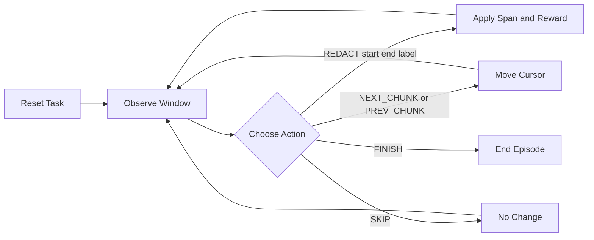

# Pii Redaction Env


Pii Redaction Env is a sequential PII-redaction environment for evaluating agents on:

1. Span localization (absolute start/end correctness)
2. Label correctness (EMAIL/PHONE/SSN/NAME/ADDRESS/DOB)
3. Utility preservation (avoid over-redaction)

This README is synchronized with the current code paths in inference, server runtime, and task definitions.

## What Changed (Current Behavior)

- Inference now defaults to connecting to an already-running endpoint at `http://localhost:7860`.
- Docker image launch from inference is opt-in (`USE_DOCKER_IMAGE=1`).
- Endpoint mode no longer depends on `/grade` for end-of-episode summary.
- Reward transport was hardened for endpoint mode (step reward can be read from StepResult and fallback fields).
- LLM request calls in inference are non-blocking (`asyncio.to_thread`) to avoid websocket keepalive timeouts.

## Tasks and Difficulty

The environment has three benchmark tasks with increasing difficulty:

| Task | Difficulty | Objective | Success threshold | Max steps |
| --- | --- | --- | --- | --- |
| `gdpr_contract_easy` | Easy | Obvious PII in business contracts (regex-friendly) | 0.90 | 40 |
| `hipaa_medical_medium` | Medium | Contextual medical identifiers (name/DOB/phone/address) | 0.85 | 60 |
| `security_logs_hard` | Hard | Obfuscated + ambiguous PII with over-redaction risk | 0.75 | 80 |

Difficulty increases from straightforward pattern matching to context-heavy and adversarial text.

## Environment Contract



This Mermaid diagram uses GitHub-supported syntax only.

### State Space (Observation)

The `RedactionObservation` provides the agent with a partial, localized view of the document. All indices are absolute offsets from the beginning of the document.

- **`visible_text`**: A sliding window of text (default size 500 characters) centered at the current `cursor_position`. Already redacted spans are masked with `[REDACTED]` or `█` characters.
- **`cursor_position`**: The current absolute character offset in the document.
- **`document_length`**: Total character count of the document.
- **`redacted_spans`**: A list of all previously applied `(start, end)` spans in the current episode.
- **`progress_pct`**: Fraction of the document visible or processed (window end / document length).
- **`previous_actions`**: A history of the most recent 5 actions taken by the agent.
- **`done`**: Boolean indicating if the episode has terminated (via `FINISH` or max steps).

### Action Space

The agent interacts with the environment using a discrete set of actions:

- **`REDACT(start, end, label)`**: Applies redaction to a specific span.
  - `start`, `end`: Absolute document offsets.
  - `label`: Entity type (e.g., `EMAIL`, `PHONE`, `SSN`).
- **`NEXT_CHUNK`**: Slides the observation window forward by half its size (`window_size // 2`).
- **`PREV_CHUNK`**: Slides the observation window backward by half its size.
- **`SKIP`**: No change to the environment state. Useful for moving past non-PII text.
- **`FINISH`**: Explicitly ends the episode once the agent believes all PII is redacted.

## Reward Model (Intuition & Implementation)

The environment uses a **Meaningful Reward Function** designed to provide a continuous signal rather than a sparse binary success metric.

### Intuition

1.  **Full Trajectory Signal**: Unlike simple "end-of-episode" rewards, the environment provides feedback at every step. This helps the agent learn which specific actions are beneficial.
2.  **Rewards Partial Progress**: Using Potential-Based Reward Shaping (PBRS), the agent receives a positive "shaping" reward whenever it improves the overall state of the document (e.g., finding a new PII entity).
3.  **Penalizes Undesirable Behavior**:
    *   **Infinite Loops**: "Duplicate Action" penalties prevent the agent from repeatedly redacting the same span.
    *   **Destructive Actions**: Large "Invalid Action" penalties are applied for out-of-bounds indices or malformed spans.
    *   **Over-redaction**: The `Utility` component of the potential function penalizes redacting more than 25% of the document, encouraging precision.

### Mathematical Formulation

Step reward is composed of **PBRS Shaping** plus direct bonuses and penalties.

**Potential Function ($\Phi$):**
Balanced across localization, classification, and utility preservation:
$$
\Phi(s) = 0.55 \cdot F1 + 0.15 \cdot LabelAccuracy + 0.30 \cdot Utility
$$

**Shaping Reward ($r_{shape}$):**
$$
r_{shape} = \Phi(s_{t+1}) - \Phi(s_t)
$$
*Note: $\gamma=1.0$ is used to maintain policy invariance in this episodic task.*

**Direct Components:**
- **`tp_bonus`**: $0.5 \cdot IoU$ (Reward for correct localization).
- **`fp_penalty`**: $-0.2 \cdot (1 - IoU)$ (Penalty for incorrect spans).
- **`duplicate_penalty`**: $-0.2 \cdot count$ (Penalty for re-redacting).
- **`invalid_penalty`**: $-1.0$ (Critical penalty for malformed actions).

### Normalization Note
In inference logs, raw rewards are often clamped and shifted to `[0, 1]` via `(raw + 1) / 2` for easier visualization of relative performance.


## Inference Runtime Modes

`inference.py` supports two modes:

1. Endpoint mode (default): connect to existing server container on `CONTAINER_BASE_URL`.
2. Docker-launch mode (opt-in): launch via `RedactionEnv.from_docker_image(...)` when `USE_DOCKER_IMAGE=1`.

### Relevant Environment Variables

Core:

- `HF_TOKEN` or `OPENAI_API_KEY`
- `API_BASE_URL`
- `MODEL_NAME`
- `TEMPERATURE`
- `OPENAI_SEED`
- `REQUEST_TIMEOUT_S`

Inference control:

- `CONTAINER_BASE_URL` (default: `http://localhost:7860`)
- `USE_DOCKER_IMAGE` (`0` or `1`)
- `LOCAL_IMAGE_NAME` (required only when `USE_DOCKER_IMAGE=1`)
- `INFERENCE_MAX_STEPS`
- `SUCCESS_SCORE_THRESHOLD`

Server control (container/app side):

- `PII_WINDOW_SIZE` (default `500` in server app factory)
- `PII_MAX_STEPS`
- `PII_TASK_ID`

Note: If you intended to change window size, use `PII_WINDOW_SIZE` (not `PII_WINDOW_STEPS`).

## Setup and Run

Install:

```bash
uv sync
```

Run tests:

```bash
uv run pytest
```

Start server locally:

```bash
uv run uvicorn server.app:app --reload --host 0.0.0.0 --port 7860
```

Or:

```bash
uv run server
```

Run inference (recommended with project env):

```bash
uv run python inference.py
```

## Docker

Build image:

```bash
docker build -t pii_redaction_env-env:latest -f server/Dockerfile .
```

Run container:

```bash
docker run --rm -p 7860:7860 pii_redaction_env-env:latest
```

## Example Inference Output (Current)

Configuration used:

- `MODEL_NAME=google/gemma-4-31b-it`
- `PII_WINDOW_SIZE=500`

```text
[START] task=gdpr_contract_easy env=pii_redaction model=google/gemma-4-31b-it
[STEP] step=1 action=REDACT(59,69) reward=0.86 done=false error=null
[STEP] step=2 action=REDACT(85,108) reward=0.85 done=false error=null
[STEP] step=3 action=REDACT(123,131) reward=0.73 done=false error=null
[STEP] step=4 action=FINISH reward=0.50 done=true error=null
[END] success=true steps=4 score=0.736 rewards=0.86,0.85,0.73,0.50

[START] task=hipaa_medical_medium env=pii_redaction model=google/gemma-4-31b-it
[STEP] step=1 action=REDACT(56,73) reward=0.89 done=false error=null
[STEP] step=2 action=REDACT(95,116) reward=0.81 done=false error=null
[STEP] step=3 action=FINISH reward=0.50 done=true error=null
[END] success=true steps=3 score=0.732 rewards=0.89,0.81,0.50

[START] task=security_logs_hard env=pii_redaction model=google/gemma-4-31b-it
[STEP] step=1 action=REDACT(61,70) reward=0.94 done=false error=null
[STEP] step=2 action=REDACT(129,137) reward=0.40 done=false error=null
[STEP] step=3 action=REDACT(178,213) reward=0.81 done=false error=null
[STEP] step=4 action=REDACT(338,368) reward=0.38 done=false error=null
[STEP] step=5 action=NEXT_CHUNK reward=0.50 done=false error=null
[STEP] step=6 action=REDACT(378,413) reward=0.41 done=false error=null
[STEP] step=7 action=FINISH reward=0.50 done=true error=null
[END] success=true steps=7 score=0.563 rewards=0.94,0.40,0.81,0.38,0.50,0.41,0.50
```

## Hugging Face Spaces

Deploy:

```bash
openenv push
```

The space serves API + UI from the same container (`app_port: 7860`, `base_path: /web`).

## Project Layout

```text
pii_redaction_env/
├── client.py
├── inference.py
├── models.py
├── openenv.yaml
├── pyproject.toml
├── README.md
├── sample_inference_script.py
├── server/
│   ├── app.py
│   ├── Dockerfile
│   ├── graders.py
│   ├── pii_redaction_env_environment.py
│   ├── tasks.py
│   └── data/
└── tests/
```

## Contribution

Fork and open PR from Hub:

```bash
openenv fork Aayush5665/pii_redaction_env --repo-id <your-username>/<your-repo-name>
cd <forked-repo>
openenv push Aayush5665/pii_redaction_env --create-pr
```
